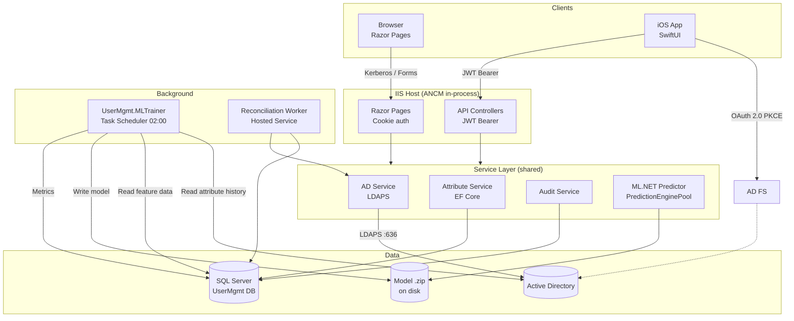
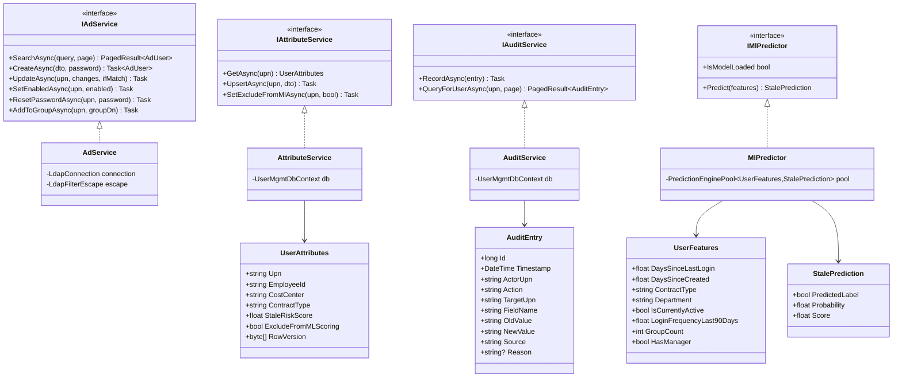
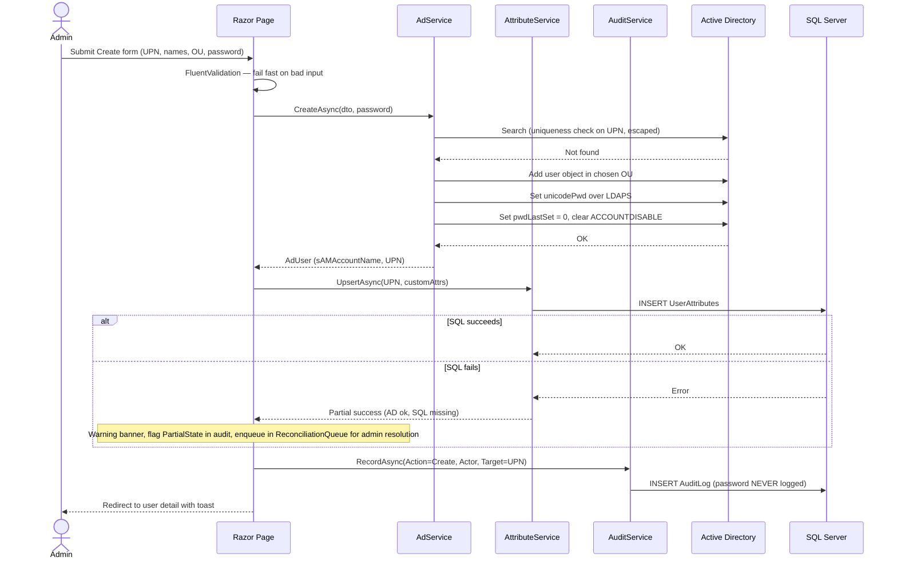
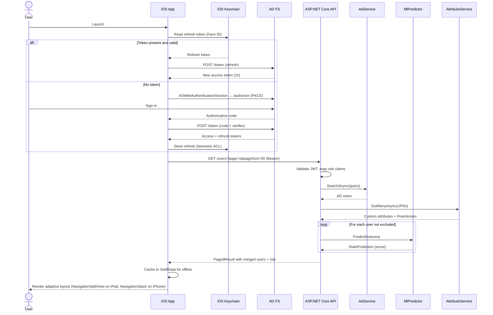
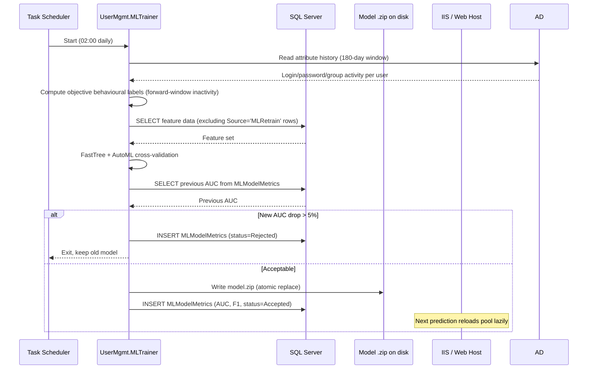

# AD User Management

> Active Directory administration for the browser and native iOS (iPhone + iPad), with on-premises ML-driven stale account detection.


> **Work in Progress** — this repository is under active development. Specifications, architecture, and APIs may change without notice, and the codebase is not yet ready for production use.

---

## Overview

**AD User Management** is a self-hosted enterprise application for administering Microsoft Active Directory user accounts. It pairs an ASP.NET Core Razor Pages web interface with a native SwiftUI iOS app (iPhone + iPad with adaptive layout) — both sharing a single service layer — and augments traditional CRUD with an **ML.NET stale account predictor** that runs entirely on-premises.

The product is designed for **IT administrators, helpdesks, and CISOs** at organisations that keep identity on-site, run Exchange on-prem, and need a modern administrative experience without sending employee data to the cloud. It replaces a patchwork of Active Directory Users and Computers (ADUC), PowerShell scripts, and spreadsheets with a governed, auditable, compliance-ready tool that maps directly to **GDPR** lawful-basis processing and **ISO/IEC 27001:2022** Annex A controls.

Key differentiators:

- **Two first-class clients, one backend.** The Razor Pages UI and the SwiftUI iOS app talk to the same service layer — nothing is re-implemented twice.
- **Intelligent account hygiene.** ML.NET predicts which accounts are likely to become stale using objective behavioural labels derived from AD attribute history, retrains nightly with a drift guard, and exposes scores as a sortable column and filter — alongside a transparent heuristic for side-by-side comparison.
- **Compliance by construction.** Append-only audit log enforced at the database layer, opt-out flag for automated profiling, LDAPS-only password operations, and a DPIA-ready data model.

---

## Key Features

### Identity and lifecycle

| Feature | Description |
|---|---|
| User CRUD | Create, read, update, enable, disable, and delete accounts in AD with optimistic concurrency via LDAP attribute-level CAS (delete-old/add-new) on AD and `RowVersion` on SQL |
| OU picker | Admins create users only in OUs whitelisted in configuration — no arbitrary OU writes |
| Password reset | Random 16-character generator, LDAPS-only `unicodePwd` write, `pwdLastSet = 0` to force change at next login |
| Group membership | Type-ahead group picker, add/remove via `member` attribute on the group object, per-change audit rows |
| Soft delete | Move to "Deleted Users" OU with configurable grace period before hard delete |

### Intelligence

| Feature | Description |
|---|---|
| Stale risk scoring | ML.NET `FastTree` binary classifier over 8 behavioural features, labelled from AD attribute history (not the audit log — see [Why our labels don't come from our own audit log](#why-our-labels-dont-come-from-our-own-audit-log)) |
| Nightly retrain | Windows Task Scheduler runs `UserMgmt.MLTrainer` at 02:00. Labels are computed from forward-window AD behaviour over the prior 180 days. Audit rows with `Source='MLRetrain'` are always excluded from training to prevent feedback loops. Model metrics written to SQL for drift monitoring. |
| Drift guard | New model rejected if AUC drops by more than 5% vs. previous run |
| Heuristic comparison | UI surfaces a side-by-side badge showing the ML score and a transparent rule-based flag (`lastLogon > 90d`). Admins can sanity-check the model on every user. |
| GDPR opt-out | `ExcludeFromMLScoring` flag on `UserAttributes` removes a user from automated profiling |

### Bulk and export

| Feature | Description |
|---|---|
| Multi-select | Checkbox column, "select all" applies to filtered rows only |
| Bulk actions | Disable, enable, delete, change department, add to group — all with confirm dialogs |
| Export | Filtered CSV or Excel, audit log entry per export with the filter criteria captured |

### Platform

| Feature | Description |
|---|---|
| Razor Pages web UI | Windows Authentication (Kerberos) with Forms-auth fallback, antiforgery on all posts, CSP headers |
| SwiftUI iOS app | Adaptive layout (`NavigationSplitView` on iPad, `NavigationStack` on iPhone), `@Observable` view models, OAuth 2.0 PKCE via AD FS, Face ID unlock |
| Offline cache (iOS) | SwiftData snapshot of the last user list, banner indicates staleness |
| Localisation | German (default) and English, `.resx` resources, locale-aware date formatting |
| Accessibility | WCAG 2.1 AA: focus trapping in modals, ARIA live regions, keyboard navigation end-to-end |

### Observability and compliance

| Feature | Description |
|---|---|
| Append-only audit log | Field-level old/new values, actor UPN, IP, source (Web/API/MLRetrain), reason code on disable/delete actions (Stale/Termination/Reorg/Compromise), DB-level DENY DELETE/UPDATE |
| Application log | Serilog with `MSSqlServer` sink, 90-day retention via SQL Agent |
| Health endpoint | `/health` reports AD bind, SQL reachability, ML model load status |
| Data subject reports | One-click export of everything the system holds about a given UPN |

---

## Tech Stack

| Category | Technology | Purpose |
|---|---|---|
| Web framework | ASP.NET Core 8 Razor Pages | Server-rendered admin UI, Windows Authentication, antiforgery |
| Web API | ASP.NET Core 8 Controllers + JWT Bearer | REST surface for the iOS client |
| Identity (directory) | Active Directory over LDAPS | Source of truth for identity; all password ops on port 636 |
| Identity (OAuth) | AD FS (on-premises) | OAuth 2.0 Authorization Code with PKCE for the iOS app |
| Persistence | SQL Server on-premises + EF Core | Sidecar store for custom attributes, audit, app logs, ML metrics |
| ORM | Entity Framework Core | `RowVersion` concurrency, interceptor-based query timing |
| Object mapping | Mapperly (`Riok.Mapperly`) | Compile-time source-generated mapping between domain types and API DTOs; no runtime reflection, AOT-friendly |
| Validation | FluentValidation | One validator set shared between Razor models and API DTOs |
| Logging | Serilog + `Serilog.Sinks.MSSqlServer` | Structured logs to SQL, 90-day retention |
| Machine learning | ML.NET 3.x (`BinaryClassification.FastTree`, AutoML) | Stale account prediction, served via `PredictionEnginePool` |
| Identity context | `ICurrentActor` abstraction (DI) | Surface-agnostic actor flow for Razor (Kerberos), API (JWT), `MLTrainer` (system), and `Reconciliation` worker. UPN resolved via `IClaimsTransformation` + SID-keyed `IMemoryCache`. |
| Rate limiting | AspNetCoreRateLimit | 100 req/min per user on the API |
| API versioning | URL-prefixed (`/api/v1/`) | Versioned routing from day one; additive non-breaking changes within a version |
| iOS app | SwiftUI (iOS 26 / iPadOS 26) | Adaptive layout (`NavigationSplitView` on iPad, `NavigationStack` on iPhone), `@Observable` state |
| iOS networking | `URLSession` async/await | Typed API client with Combine debounce on search |
| iOS auth | `ASWebAuthenticationSession` + `LAContext` | PKCE login, Face ID / Touch ID unlock |
| iOS storage | Keychain (biometric ACL) + SwiftData | Refresh token and offline snapshot |
| Hosting | IIS with ANCM in-process | HTTPS-only, internal CA, gMSA application pool identity |
| Scheduler | Windows Task Scheduler | Nightly `UserMgmt.MLTrainer` runs |
| CI/CD | `dotnet publish` + Web Deploy, Xcode Cloud / Azure DevOps for iOS | Two parallel pipelines, one backend |

---

## Architecture

The system is a shared-service architecture. A single ASP.NET Core host on IIS terminates two client surfaces — Razor Pages (cookie auth) and JSON API (JWT Bearer). Both surfaces call the same service layer: `AdService`, `AttributeService`, `AuditService`, and `MlPredictor`. Actor identity flows through both surfaces via a single `ICurrentActor` abstraction, so the service layer never sees ASP.NET Core types. Active Directory is the system of record for identity. SQL Server is the sidecar — it stores the firm-specific attributes, the append-only audit log, the application log (Serilog), the ML model metrics, and a `ReconciliationQueue` for partial-state recovery (admin-resolved, not auto-retry — see [Cross-store consistency](#cross-store-consistency) below).

Cross-store writes (mainly Create User) follow an AD-first, SQL-second order. If the SQL sidecar insert fails after the AD object exists, the failure is logged to the audit trail with a high-visibility `PartialState` flag and the affected user is surfaced in the admin `ReconciliationQueue`. The system does not attempt automatic rollback of the AD change (AD replication makes compensation unreliable) and does not retry SQL writes that fail for non-transport reasons (concurrency or constraint violations require human resolution). Update flows are largely single-store — most AD attributes update AD; most custom attributes update SQL — so the cross-store partial-state window is narrowly bounded to Create.

The ML.NET pipeline is deliberately out-of-process. A separate console app, `UserMgmt.MLTrainer`, computes objective behavioural labels from AD attribute history (forward-window inactivity over the prior 180 days), trains a `FastTree` binary classifier on those labels, and writes a serialized `.zip` model to disk. The audit log is never used as a label source; for the rationale see [Why our labels don't come from our own audit log](#why-our-labels-dont-come-from-our-own-audit-log). The web host loads the model via `PredictionEnginePool` on startup and serves predictions inline (<5ms per user).

A standalone console utility, `UserMgmt.ADImport`, copies users, groups, and SQL sidecar rows from the production AD forest to a lab forest for demo and UAT use. It is read-only against production, refuses to run if its target matches the production domain, and re-maps the `manager` DN reference across forests.



---

## Code Structure

The solution is split into a handful of focused projects. The web host and API share a service layer; the ML trainer and AD import tool are independent console apps; the iOS app is its own Xcode workspace.

```text
ad-user-management/
├── src/
│   ├── UserMgmt.Web/                  ASP.NET Core host (Razor Pages + API)
│   │   ├── Pages/                     Razor Pages (Index, Edit, Groups, Audit)
│   │   ├── Api/                       Versioned controllers (/api/v1/) for the iOS client
│   │   ├── Auth/                      ICurrentActor impls (Kerberos, JWT), IClaimsTransformation
│   │   ├── Mappers/                   Mapperly partial classes (Api DTOs ↔ Domain)
│   │   ├── wwwroot/                   Static assets, CSS, CSP-compatible JS
│   │   └── Program.cs                 DI, auth, Serilog, ML pool, health checks
│   ├── UserMgmt.Core/                 Domain + service layer (shared)
│   │   ├── Services/                  AdService, AttributeService, AuditService
│   │   ├── Auth/                      ICurrentActor abstraction, Actor record
│   │   ├── Ml/                        UserFeatures, StalePrediction, MlPredictor
│   │   ├── Validation/                FluentValidation validators
│   │   └── Ldap/                      LdapFilterEscape, singleton AdConnection per DC, async wrappers
│   ├── UserMgmt.Data/                 EF Core DbContext + migrations
│   │   ├── Entities/                  UserAttributes, AuditLog, AppLog, ReconciliationQueue
│   │   └── Interceptors/              Query timing, audit interceptor
│   ├── UserMgmt.MLTrainer/            Console — nightly retrain job
│   ├── UserMgmt.ADImport/             Console — prod → dev forest import
│   └── UserMgmt.Website/              Marketing site (Razor Pages / static)
├── ios/
│   └── UserMgmt.iOS/                  Xcode project (SwiftUI, iOS 26 / iPadOS 26)
│       ├── Features/                  Adaptive views (size-class-aware layouts)
│       │   ├── Login/                 LoginView, ASWebAuthenticationSession
│       │   ├── UserList/              UserListView, filter chips, search, ML+heuristic badges
│       │   ├── UserDetail/            Tabs: Identity, Org, Custom, Audit
│       │   └── Settings/
│       ├── Services/                  ApiClient, KeychainStore, SwiftDataCache
│       └── Models/                    UserDto, StaleRiskLevel, Role
├── tests/
│   ├── UserMgmt.Core.Tests/           xUnit — services, validators, LDAP escape
│   ├── UserMgmt.Web.Tests/            Integration tests for Razor + API
│   ├── UserMgmt.MLTrainer.Tests/      Model training fixtures
│   └── UserMgmt.iOS.Tests/            Swift Testing — view models, API client, adaptive layout
├── deploy/
│   ├── iis/                           web.config, ANCM settings
│   ├── sql/                           Schema, seed, retention SQL Agent jobs
│   └── ad/                            dsacls scripts for OU delegation
└── README.md
```

The class diagram below focuses on the server-side service layer. The iOS models are not repeated here — they are straightforward DTOs over the API.



---

## Sequence Diagrams

### Create user (Razor Pages)

The create flow is the canonical "happy path" — it exercises AD validation, LDAPS password write, SQL sidecar insert, and the audit trail in a single request. A partial success (AD succeeded, SQL failed) is surfaced to the admin, not silently swallowed.



### iOS login and stale-risk-gated user list

The iOS flow (iPhone and iPad share this path) demonstrates the split between the identity provider (AD FS), the API, and the ML.NET predictor. Face ID unlocks the keychain-stored refresh token on subsequent launches so the user never sees the web view again unless the refresh token expires.



### Nightly ML retrain with drift guard

The trainer is out-of-process by design — a crash or long run cannot take the web host down. The drift guard protects the production serving path from a newly regressed model.



---

## Why our labels don't come from our own audit log

A naïve design for a stale-account predictor reads disable/delete rows from its own audit log as positive training examples, and treats currently active accounts as negatives. We considered that approach and rejected it.

**The circularity problem.** If admins decide which accounts to disable partly based on the model's score, then those disables flow back into the training set as confirmed positives. The model reinforces its own past decisions, including its mistakes, and errors become self-fulfilling. In a small-to-mid org with 50–200 disable events per year, this feedback loop dominates the signal within a few retrain cycles.

**Selection and label-confounding bias.** Admins typically disable accounts using heuristics ("no login for 90 days"). A model trained on those labels just re-learns the heuristic and adds no predictive value over a SQL `WHERE` clause. Worse, "disabled" doesn't equal "stale" — disables also happen for termination, reorg, role change, and compromise. Without separating these, every disable label is contaminated.

**Our approach.** Labels are computed objectively from AD's own behavioural data, never from admin actions:

- For each historical user-month, the trainer reads `lastLogonTimestamp`, `msDS-LastSuccessfulInteractiveLogonTime`, `pwdLastSet`, and group membership snapshots over a 180-day window.
- A label of "stale" is assigned to any user with no interactive login, no password change, and no group-membership change in a 30-day forward window from the labelling instant.
- The audit log is used only for *features* (e.g. days-since-last-admin-recorded-password-reset).
- Rows with `Source='MLRetrain'` are always excluded from any training input, even feature inputs, to eliminate residual feedback paths.

**Additional safeguards.**

- Every Disable/Delete audit entry carries a `Reason` code (Stale, Termination, Reorg, Compromise) entered by the admin in the confirm dialog. This is a compliance and forensics win independent of ML.
- The UI shows a transparent heuristic flag (`lastLogon > 90d`) alongside the ML score. Admins see both and can challenge the model on any user.
- The nightly drift guard rejects a retrained model whose AUC drops more than 5% versus the previous accepted model, using a held-out test set drawn from a strictly prior time period.

The trade-off is that we forgo the convenience of "the audit log is the training set" and accept a more complex trainer that has to walk AD attribute history. In return, the model's predictions are not contaminated by its own influence on the world it observes — which is what makes the score meaningful as evidence in any compliance review.

---

## Cross-store consistency

AD and SQL are two independent stores with no distributed transaction across them. There is no two-phase commit, no Microsoft DTC across LDAP and SQL, no built-in saga middleware. The architecture takes a pragmatic position on the partial-state problem rather than pretending it can be eliminated.

**Write ordering.** Cross-store writes — mainly Create User — follow AD-first, SQL-second. The AD object must exist before the SQL sidecar row can reference its UPN.

**Failure handling.** If the SQL sidecar insert fails after the AD object exists:

- The failure is logged to the audit trail with a high-visibility `PartialState` flag.
- The affected user is surfaced in the admin `ReconciliationQueue`.
- The web UI shows a warning banner on the original action and on the affected user's detail page until the partial state is resolved.

**What the system does *not* do:**

- It does not attempt automatic rollback of the AD change. AD replication makes compensation unreliable: the new object may already have been observed by other DCs, and the rollback can itself fail.
- It does not auto-retry SQL writes that fail for non-transport reasons. Concurrency conflicts (`RowVersion` mismatch) and constraint violations indicate the application's mental model of the data has diverged from reality; retrying the same operation will not help. These require human resolution.

**Update flows are largely single-store.** Most AD attribute updates touch only AD; most custom-attribute updates touch only SQL. The set of `UserAttributes` fields (`CostCenter`, `ContractType`, `EmployeeId`) is not mirrored in AD, so once a user is created the cross-store partial-state window is narrow.

**Concurrency primitives.** AD attribute changes use LDAP attribute-level CAS via "delete-old-value, add-new-value" in a single modify request — the only properly atomic primitive AD offers. `whenChanged` is informational and not safe for concurrency control. SQL changes use `RowVersion`.

---

## Roadmap

This project is currently at **specification stage**. No production code has shipped. The roadmap below tracks the path from spec to v1 release.

| Milestone | Scope | Status |
|---|---|---|
| M0 — Specification | System design, data model, security, compliance mapping | Complete |
| M1 — Service layer | `AdService`, `AttributeService`, `AuditService` with unit tests | Planned |
| M2 — Razor web UI | User list, search, filters, edit dialog, OU picker | Planned |
| M3 — REST API | JWT Bearer, rate limiting, paginated endpoints | Planned |
| M4 — iOS app | SwiftUI adaptive layout (iPhone + iPad), PKCE login, Face ID, SwiftData offline cache | Planned |
| M5 — ML.NET | Trainer console app with objective behavioural labels, prediction pool, drift guard, heuristic-comparison UI | Planned |
| M6 — Compliance hardening | Append-only audit enforcement, DPIA sign-off, ISO 27001 evidence pack | Planned |
| M7 — AD import tool | Prod → dev forest import with dry-run and safety check | Planned |
| M8 — Product website | Marketing site, Impressum, demo form | Planned |

### Explicitly deferred (v2)

- User photo display and upload (`thumbnailPhoto` read/write).
- Anomalous login detection (second ML model, real-time event stream).
- Push notifications for high-risk accounts (APNs).
- Offline write queuing on iOS.
- Full onboarding and offboarding workflows (chained account + mailbox + home directory + HR notify).
- On-device Foundation Models for natural-language search of the user list (iOS 26+).

---

## Status

**Work in Progress — specification grilled and approved; implementation underway.**

All architectural decisions, data schemas, security controls, and compliance mappings in this document are drawn from the approved v1.0 specification, which has been pressure-tested against the failure modes a real deployment will encounter (cross-store consistency, dual concurrency, ML feedback loops). The repository will be progressively populated through the milestones above; this README will be updated with screenshots, benchmarks, and build status badges as each milestone lands.

---

## License

Released under the [MIT License](./LICENSE).
