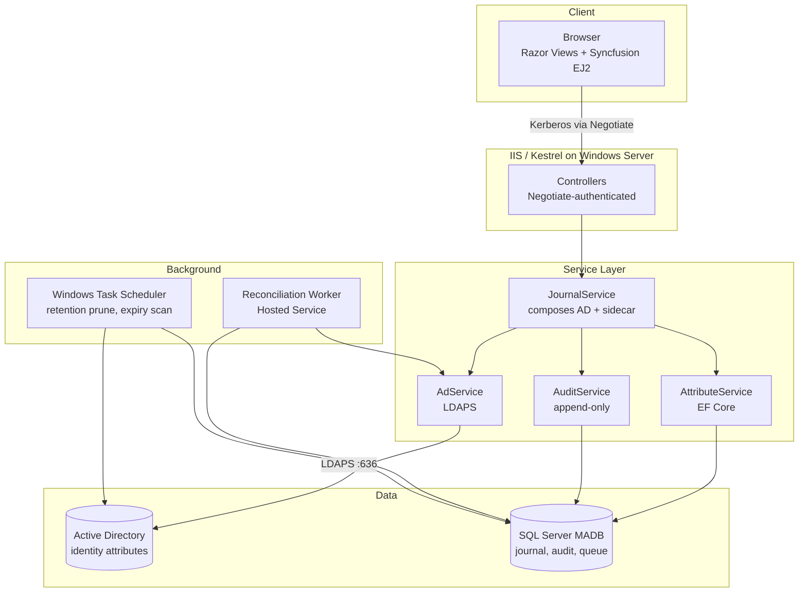
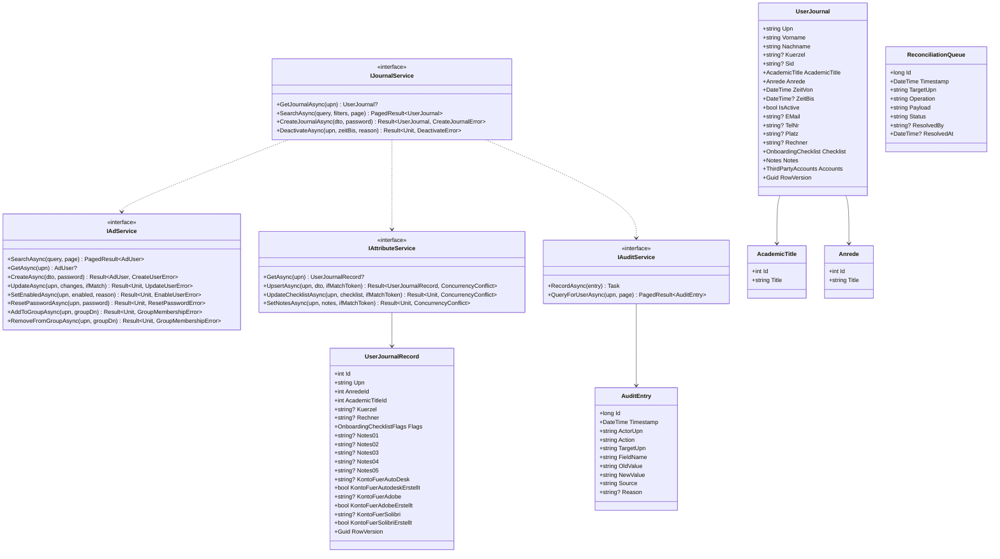
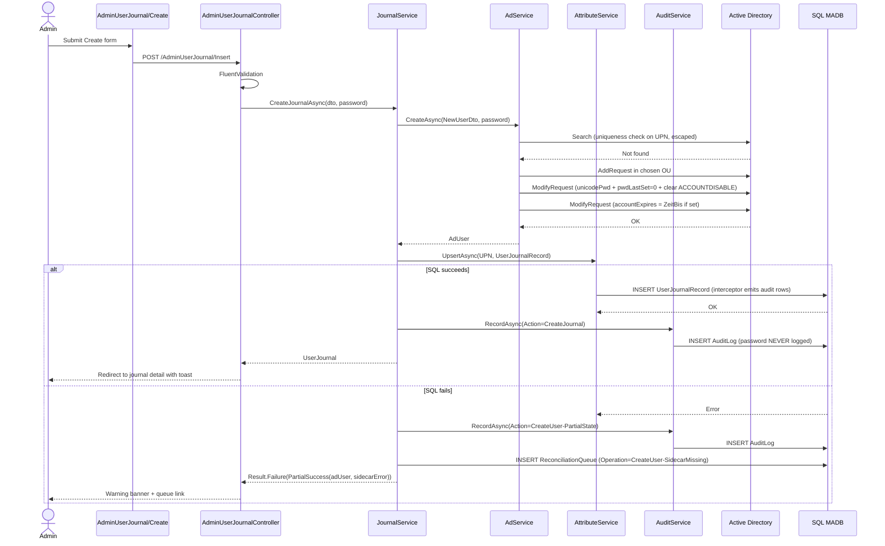
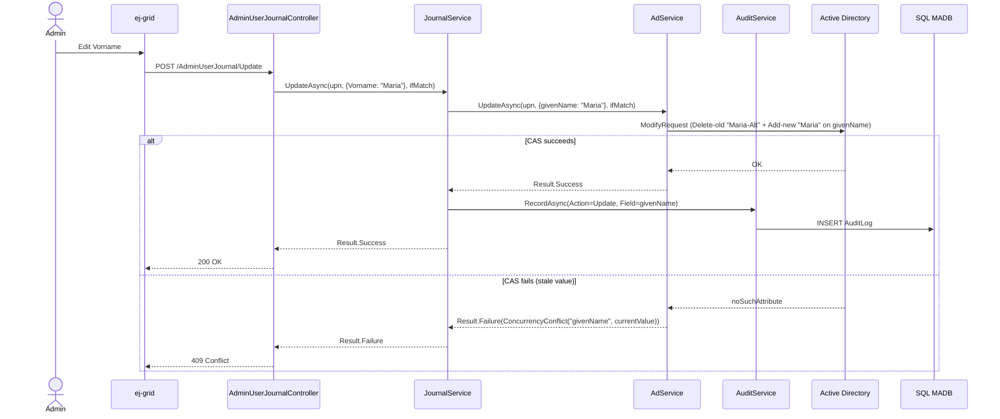

# AD User Management

> Active Directory–integrated employee lifecycle journal — onboarding and offboarding checklist tracking with AD as the system of record for identity attributes and a SQL sidecar for application-specific data.


> **Work in Progress** — this repository is under active development. Specifications, architecture, and APIs may change without notice, and the codebase is not yet ready for production use.

---

## Overview

**AD User Management** is a self-hosted enterprise application for tracking the lifecycle of employee accounts in Active Directory. It replaces a patchwork of Active Directory Users and Computers (ADUC), PowerShell scripts, spreadsheets, and ASP.NET Identity logins with a single governed tool centred on a per-employee **journal** record. Each journal entry captures the joining date, departure date, identity attributes synchronised from AD, freeform case notes, and a comprehensive **onboarding checklist** covering every IT provisioning step (AD account, password, mail postbox, ActiveSync, OpenVPN certificate, third-party SaaS accounts, training material, and more).

The product is designed for **IT administrators, helpdesks, and compliance officers** at organisations that keep identity on-site and need an auditable, structured record of every provisioning step taken for every employee. Authentication is **true Single Sign-On** against the on-prem Active Directory via Windows Negotiate (Kerberos) — no second password, no separate Identity table.

Key differentiators:

- **AD is the system of record for identity.** `Vorname`, `Nachname`, `mail`, `telephoneNumber`, account-enabled state, and account expiration live in AD. The application reads and writes them through a typed service layer; the AD schema stays unmodified.
- **SQL sidecar for application-specific data.** The onboarding checklist, freeform notes, salutation (Anrede), academic title lookup, third-party account references, and the audit log live in a SQL Server database (`MADB`). This split keeps AD pristine while giving the application rich query, audit, and history capabilities AD cannot offer.
- **Compliance by construction.** Append-only audit log enforced at the database layer (DENY UPDATE / DELETE for the application identity), LDAPS-only password operations, gMSA application-pool identity, and a data model that maps directly to **GDPR** lawful-basis processing and **ISO/IEC 27001:2022** Annex A controls.
- **True AD SSO.** Windows Authentication via the Negotiate protocol. Domain-joined browsers present the user's existing Kerberos ticket; no login page, no second password, no AD FS, no Entra dependency.

---

## Key Features

### Employee journal

| Feature | Description |
|---|---|
| Per-employee journal | One `UserJournal` record per employee, capturing identity, contact, lifecycle dates (`ZeitVon`/`ZeitBis`), salutation (Anrede), academic title, freeform notes (`Notes01`–`Notes05`), and the onboarding checklist |
| Identity sync from AD | `Vorname`, `Nachname`, `Sid`, `mail`, `telephoneNumber`, `physicalDeliveryOfficeName`, account-enabled state read live from AD on each load — never duplicated to SQL |
| Lifecycle dates | `ZeitVon` (start) and `ZeitBis` (end, nullable) drive the active/inactive view, with `accountExpires` in AD kept in lockstep with `ZeitBis` |
| Soft delete | Departing employees set `ZeitBis`; their AD account is disabled via `userAccountControl`; their journal record persists for audit and reporting |
| Lookups | `AcademicTitle` (Dr./Prof./Dipl.-Ing./…) and `Anrede` (Herr/Frau/Divers/…) are reference tables, maintained through dedicated admin views |

### Onboarding checklist

| Feature | Description |
|---|---|
| ~20 provisioning steps | Each journal carries booleans for AD password set, AD account created, AD account configured, TK account created, mail postbox created, ActiveSync permissions, Mail Marshal, calendar permissions, quota, WiFi guest account, cloud account, OpenVPN certificate, RDP training scripts, mail-matrix sheet, Wake-on-LAN, computer-usage sheet, password list (printed 2×), BPC3 user-list updated, BPC3 person created, BPC3 user created, BPC1 account, and more |
| Third-party accounts | Each of Autodesk, Adobe, and Solibri carries a *created* boolean plus a 1024-character free-text field for account identifiers / licence references |
| Freeform notes | Five long-form note fields (`Notes01`–`Notes05`, `ntext`) for case-specific context the structured fields cannot capture |
| Field-level audit | Every checklist tick, note edit, or field change emits an `AuditEntry` row via the EF Core `SaveChangesInterceptor` (actor UPN, source surface, field name, old/new value, timestamp) |

### Active Directory operations

| Feature | Description |
|---|---|
| User CRUD | Create, read, update, enable, disable, and delete AD accounts with optimistic concurrency via LDAP attribute-level CAS (delete-old/add-new) on AD and `RowVersion` on SQL |
| OU whitelist | Admins create users only in OUs whitelisted in configuration — no arbitrary OU writes |
| Password reset | Random 16-character generator, LDAPS-only `unicodePwd` write, `pwdLastSet = 0` to force change at next login |
| Group membership | Type-ahead group picker, add/remove via the group's `member` attribute (not the user's `memberOf` back-link), per-change audit rows |
| Account expiration | `ZeitBis` writes to AD's `accountExpires` attribute; the account expires automatically at the journal-recorded departure date |

### Bulk and export

| Feature | Description |
|---|---|
| Multi-select | Checkbox column on the grid; "select all" applies to filtered rows only |
| Bulk actions | Disable, enable, delete, change department, add/remove from group — all with confirm dialogs |
| Export | Filtered CSV or Excel; audit log entry per export with the filter criteria captured |
| View filters | Toolbar buttons for *Alle Nutzer* / *Aktive Nutzer* / *Inaktive Nutzer*; column chooser for show/hide; Excel-style filter on every column |

### Platform

| Feature | Description |
|---|---|
| ASP.NET Core 10 MVC | Server-rendered admin UI with Controllers + Views, matching the reference codebase's mental model |
| Windows Authentication | True SSO via the Negotiate protocol (Kerberos primary, NTLM fallback); UPN resolved into a claim by `IClaimsTransformation`, cached by SID in `IMemoryCache` |
| Syncfusion EJ2 ASP.NET Core | `ej-grid` for the journal list with dialog-mode editing, filtering, column chooser, paging, and toolbar buttons (under Syncfusion's Community License) |
| Antiforgery | Enabled on every POST; tokens validated server-side |
| Content-Security-Policy | Strict CSP with per-request nonces for inline scripts; no third-party origins beyond a configurable Syncfusion CDN entry |
| Localisation | German (default) and English; `.resx` resources; locale-aware date formatting (`dd/MM/yyyy`) |
| Accessibility | WCAG 2.1 AA: focus trapping in dialogs, ARIA live regions, keyboard navigation across the grid |

### Observability and compliance

| Feature | Description |
|---|---|
| Append-only audit log | Field-level old/new values, actor UPN, IP, source (`Web` / `System`), reason code on disable/delete actions (Stale / Termination / Reorg / Compromise), DB-level `DENY DELETE`, `DENY UPDATE` for the app identity |
| Application log | Serilog with `MSSqlServer` sink, 90-day retention via SQL Agent |
| Health endpoint | `/health` reports AD bind, SQL reachability, gMSA permissions |
| Data subject reports | One-click export of every row pertaining to a single UPN — supports GDPR Articles 15 (access) and 17 (erasure) requests |

---

## Tech Stack

| Category | Technology | Purpose |
|---|---|---|
| Web framework | ASP.NET Core 10 MVC | Controllers + Views server-rendered admin UI, matching the customer's existing codebase pattern |
| UI components | Syncfusion EJ2 ASP.NET Core (v28.x) | Data grid, dialogs, date pickers, form controls under Syncfusion's free Community License |
| Identity (directory) | Active Directory over LDAPS | Source of truth for identity attributes; all password operations on port 636 |
| Auth | `Microsoft.AspNetCore.Authentication.Negotiate` | True SSO via Kerberos (NTLM fallback); domain-joined browsers send the user's existing Kerberos ticket — no login page |
| Persistence | SQL Server `MADB` + EF Core 10 | Sidecar store for journal, lookups, audit, app logs, reconciliation queue |
| ORM | Entity Framework Core | `RowVersion`/`Guid` concurrency, interceptor-based audit + query timing |
| Object mapping | Mapperly (`Riok.Mapperly`) | Compile-time source-generated mapping between domain types and view models; no runtime reflection |
| Validation | FluentValidation | One validator set shared between MVC view models and service-layer DTOs |
| Logging | Serilog + `Serilog.Sinks.MSSqlServer` | Structured logs to SQL, 90-day retention |
| Identity context | `ICurrentActor` abstraction (DI) | Surface-agnostic actor flow for MVC (Negotiate-derived UPN) and background services (system actor); UPN resolved via `IClaimsTransformation` + SID-keyed `IMemoryCache` |
| Rate limiting | AspNetCoreRateLimit | Configurable per-endpoint throttling for unattended automation |
| Hosting | IIS with ANCM in-process or Kestrel-on-Windows-Server | HTTPS-only, internal CA, gMSA application-pool identity |
| Scheduler | Windows Task Scheduler | Nightly maintenance jobs (audit log retention prune, expired-account scan) |
| CI/CD | `dotnet publish` + Web Deploy | Single pipeline; built and tested on GitHub Actions Linux runners, deployed to Windows IIS |

---

## Architecture

The system is a thin web UI over a typed service layer. The MVC host on Windows Server (IIS in-process or Kestrel-with-HTTP.sys) terminates one client surface — Razor Views authenticated with Windows Negotiate. Controllers call the shared service layer: `AdService` (LDAPS, attribute-level CAS), `AttributeService` (EF Core sidecar), `AuditService` (append-only writes), and `JournalService` (the journal-domain orchestrator that combines AD and sidecar reads into a single `UserJournal` view-model).

**Hybrid storage** is the architectural backbone. Active Directory is the system of record for the 11 identity, contact, and lifecycle attributes that already have native AD homes; the SQL sidecar (`MADB`) is the system of record for the 26 application-specific attributes (onboarding checklist, freeform notes, Anrede salutation, third-party account references, audit log, reconciliation queue) that AD cannot store cleanly. The AD schema is **never extended** — schema extensions are operationally irreversible, and the application-specific data is the wrong shape for AD anyway. See [Why journal data isn't all in AD](#why-journal-data-isnt-all-in-ad) for the full rationale.

Cross-store writes (mainly Create User, and any sync between `ZeitBis` and AD's `accountExpires`) follow an AD-first, SQL-second order. If the SQL sidecar write fails after the AD object exists, the failure is logged to the audit trail with a high-visibility `PartialState` flag and the affected user is surfaced in the admin `ReconciliationQueue`. The system does not attempt automatic rollback of the AD change (AD replication makes compensation unreliable) and does not retry SQL writes that fail for non-transport reasons (concurrency or constraint violations require human resolution).



---

## Code Structure

```text
ad-user-management/
├── src/
│   ├── UserMgmt.Web/                  ASP.NET Core MVC host
│   │   ├── Controllers/               AdminUserJournal, AcademicTitle, Anrede, Audit, Reconciliation, Home
│   │   ├── Views/
│   │   │   ├── AdminUserJournal/      ej-grid list + dialog edit (matching the customer's reference pattern)
│   │   │   ├── AcademicTitle/         Lookup admin
│   │   │   ├── Anrede/                Lookup admin
│   │   │   ├── Audit/                 Audit log view filtered by UPN
│   │   │   ├── Reconciliation/        Partial-state queue admin
│   │   │   └── Shared/                _Layout, _ValidationScriptsPartial, _ViewImports, _ViewStart
│   │   ├── Auth/                      ICurrentActor (Negotiate impl), IClaimsTransformation
│   │   ├── Mappers/                   Mapperly partial classes (Sidecar entities ↔ View models)
│   │   ├── wwwroot/                   Static assets, CSS, CSP-compatible JS, Syncfusion theme
│   │   └── Program.cs                 DI, Negotiate auth, Serilog, health checks, antiforgery, CSP
│   ├── UserMgmt.Core/                 Domain + service layer
│   │   ├── Auth/                      ICurrentActor abstraction, Actor record
│   │   ├── Common/                    Result, PagedResult, error types
│   │   ├── Domain/                    AdUser, UserJournal (view-model), UserJournalRecord, AcademicTitle, Anrede, OnboardingChecklist
│   │   ├── Ldap/                      IAdConnection, AdConnection, LdapFilterEscape, LdapsRequiredException
│   │   ├── Services/                  IAdService, IAttributeService, IAuditService, IJournalService
│   │   └── Validation/                FluentValidation validators
│   ├── UserMgmt.Data/                 EF Core
│   │   ├── UserMgmtDbContext.cs
│   │   ├── Entities/                  UserJournalRecord, AcademicTitle, Anrede, AuditEntry, AppLog, ReconciliationQueue
│   │   ├── Interceptors/              AuditSaveChangesInterceptor
│   │   ├── Services/                  AttributeService, AuditService, JournalService (depend on UserMgmtDbContext)
│   │   └── Migrations/                EF Core migrations
│   └── UserMgmt.Website/              Marketing site (Razor Pages / static)
├── tests/
│   └── UserMgmt.Core.Tests/           xUnit + NSubstitute + Shouldly + SQLite-in-memory
├── deploy/
│   ├── iis/                           web.config, ANCM settings
│   ├── sql/                           Schema, seed, retention SQL Agent jobs
│   └── ad/                            dsacls scripts for OU delegation
└── README.md
```

### Class diagram (server-side service layer)



---

## Sequence Diagrams

### Create a new employee journal

A new hire flows through: admin fills the create dialog (Vorname/Nachname/OU/start date/Anrede/AcademicTitle/etc.) → AD object created with LDAPS password write → SQL `UserJournalRecord` row inserted with the application-specific data → audit row recorded. On sidecar failure, the AD object exists; the failure is surfaced in the Reconciliation queue for manual resolution.



### Tick an onboarding checklist item

The high-frequency operation. Single sidecar write; AD untouched. Audit interceptor captures the field-level change automatically.

```mermaid
sequenceDiagram
    actor Admin
    participant Grid as ej-grid (Syncfusion)
    participant Ctrl as AdminUserJournalController
    participant Jrn as JournalService
    participant AttrSvc as AttributeService
    participant SQL as SQL MADB

    Admin->>Grid: Tick "OpenVpnZertifikat" in dialog
    Grid->>Ctrl: POST /AdminUserJournal/Update (DataManager)
    Ctrl->>Jrn: UpdateChecklistAsync(upn, checklist, ifMatchToken)
    Jrn->>AttrSvc: UpdateChecklistAsync(upn, checklist, ifMatchToken)
    AttrSvc->>SQL: UPDATE UserJournalRecord SET OpenVpnZertifikat = 1, RowVersion = NEWID()
    Note over SQL: AuditSaveChangesInterceptor emits AuditEntry<br/>(FieldName=OpenVpnZertifikat, Old=False, New=True)
    alt RowVersion matches
        SQL-->>AttrSvc: OK
        AttrSvc-->>Jrn: UserJournalRecord
        Jrn-->>Ctrl: Result.Success
        Ctrl-->>Grid: 200 OK with refreshed row
    else Stale RowVersion
        SQL-->>AttrSvc: DbUpdateConcurrencyException
        AttrSvc-->>Jrn: Result.Failure(ConcurrencyConflict)
        Jrn-->>Ctrl: Result.Failure
        Ctrl-->>Grid: 409 Conflict; client re-fetches and prompts re-edit
    end
```

### Edit an AD-resident identity attribute

Editing `Vorname` writes only to AD; SQL sidecar is untouched.



---

## Why journal data isn't all in AD

A natural first instinct is to put every employee attribute into Active Directory, since AD already stores identity. We considered that and rejected it for the application-specific journal data.

**AD is an identity directory, not an application database.** AD is tuned for attribute lookup against a population via LDAP filters, with multi-master replication across domain controllers. Per-attribute writes are slow (50–200 ms each, plus replication lag), search expressivity is limited to LDAP filter syntax, and there is no native support for compound queries, joins, or rich audit trails. For 5 contact fields per user that read 1 000× more than they write, the trade-off is acceptable — those are identity. For 20+ application booleans that get toggled multiple times during an onboarding flow, AD is the wrong tool.

**Schema extensions are irreversible.** Adding ~26 custom attributes to your customer's AD forest would require Schema Admin rights, propagate across all DCs via `schemaUpdateNow`, and stay in the schema forever — Microsoft does not support attribute removal once a schema extension has been applied. If the application is ever retired the vestigial attributes remain in the customer's directory schema indefinitely. The hybrid model leaves AD's schema unmodified.

**The application data has the wrong shape for AD.** Most journal fields are:

- **Booleans on a checklist** (`AdAccountAnlegen`, `MailpostfachErstellen`, `OpenVpnZertifikat`, …): no native AD boolean attribute family; would have to be packed into Exchange-defined `extensionAttribute1–15` slots as encoded strings, losing typing.
- **Multiple freeform note fields** (`Notes01`–`Notes05`): AD has one `info` attribute capped at 1024 characters. Multiple long-text fields would have to be JSON-packed, losing search and per-field audit.
- **Application-specific third-party account references** (Autodesk / Adobe / Solibri): same problem.
- **Lookup foreign keys** (`AnredeId`, `AcademicTitleId`): AD has no relational-style lookups; the lookup table itself has to live somewhere.

**The hybrid model is what the application actually needs.** AD is the system of record for the 11 identity / contact / lifecycle attributes that already have well-typed native homes; the SQL sidecar (`MADB`) is the system of record for the 26 application-specific attributes. The journal view-model reads from both and presents them unified. Writes split by destination: identity-attribute changes go to AD via `AdService.UpdateAsync`; journal/checklist/notes changes go to SQL via `JournalService` / `AttributeService`. No duplication.

### The 11 AD-resident attributes

| AD attribute | Journal field | Notes |
|---|---|---|
| `userPrincipalName` | `Upn` | Identity key |
| `sAMAccountName` | `Aduser` | Logon name |
| `givenName` | `Vorname` | First name |
| `sn` | `Nachname` | Surname |
| `objectSid` | `Sid` | Read-only system identity |
| `personalTitle` | `AcademicTitle.Title` | Dr./Prof./…; mirrored from the lookup row at write time |
| `mail` | `EMail` | Primary email |
| `telephoneNumber` | `TelNr` | Phone |
| `physicalDeliveryOfficeName` | `Platz` | Seat/office location |
| `accountExpires` | `ZeitBis` | Native AD account expiration |
| `userAccountControl & ACCOUNTDISABLE` | `IsActive` (inverse) | Account enabled state |

Everything else lives in `UserJournalRecord` on `MADB`.

---

## Cross-store consistency

Active Directory and SQL Server are two independent stores with no distributed transaction across them. There is no two-phase commit, no Microsoft DTC across LDAP and SQL, no built-in saga middleware. The architecture takes a pragmatic position on the partial-state problem rather than pretending it can be eliminated.

**Write ordering.** Cross-store writes — Create Journal and any `ZeitBis` ↔ `accountExpires` sync — follow AD-first, SQL-second. The AD object must exist before the SQL sidecar row can reference its UPN.

**Failure handling.** If the SQL sidecar insert fails after the AD object exists:

- The failure is logged to the audit trail with a high-visibility `PartialState` flag.
- The affected user is surfaced in the admin `ReconciliationQueue`.
- The web UI shows a warning banner on the original action and on the affected user's journal page until the partial state is resolved.

**What the system does *not* do:**

- It does not attempt automatic rollback of the AD change. AD replication makes compensation unreliable: the new object may already have been observed by other DCs, and the rollback can itself fail.
- It does not auto-retry SQL writes that fail for non-transport reasons. Concurrency conflicts (`RowVersion` mismatch) and constraint violations indicate the application's mental model of the data has diverged from reality; retrying the same operation will not help. These require human resolution.

**Update flows are largely single-store.** Most AD attribute updates touch only AD; most journal/checklist updates touch only SQL. The cross-store partial-state window is narrow — bounded to Create Journal and the occasional `accountExpires` sync.

**Concurrency primitives.** AD attribute changes use LDAP attribute-level CAS via "delete-old-value, add-new-value" in a single modify request — the only properly atomic primitive AD offers. `whenChanged` is informational and not safe for concurrency control. SQL changes use a `Guid` concurrency token rotated by the application on every successful save (an `IsConcurrencyToken()` configuration on the `UserJournalRecord.RowVersion` property).

---

## Roadmap

This project is currently at **specification stage**. The M1 service layer has shipped (AD operations, sidecar attribute service, audit log, reconciliation queue). The roadmap below tracks the path from the current state to v1 release of the journal-domain application.

| Milestone | Scope | Status |
|---|---|---|
| M0 — Specification | System design, data model, security, compliance mapping, pivot to journal domain | Complete |
| M1 — AD + sidecar service layer | `AdService`, `AttributeService`, `AuditService` with audit interceptor, append-only enforcement, attribute-level CAS, reconciliation queue | Complete |
| M2 — Journal domain layer | `UserJournalRecord` entity, `AcademicTitle` and `Anrede` lookups, `IJournalService` that orchestrates AD + sidecar reads/writes into a unified `UserJournal` view-model, plus unit tests | Planned |
| M3 — Web UI: journal list and edit | MVC Controllers + Views, Syncfusion `ej-grid` admin view with dialog edit, OU picker, password generator, lookups admin, Windows Negotiate auth wiring, antiforgery, CSP | Planned |
| M4 — Web UI: audit and reconciliation | Audit log view filtered by UPN; ReconciliationQueue admin actions (resolve, cancel, replay) | Planned |
| M5 — Bulk operations and export | Multi-select bulk actions; CSV/Excel export with filter-criteria audit | Planned |
| M6 — Compliance hardening | DPIA documentation, ISO 27001 Annex A evidence pack, retention SQL Agent jobs, gMSA setup scripts | Planned |
| M7 — AD import tool | `UserMgmt.ADImport` console: read-only prod → dev forest copy with safety checks | Planned |
| M8 — Product website | Marketing site, Impressum, demo form | Planned |

### Explicitly deferred (v2 or later)

- **Native iOS (iPhone + iPad) app.** Originally scoped as a portfolio piece; deferred indefinitely so it doesn't block customer breadth. Will be revisited once the customer's web-side scope is delivered and stable.
- **ML.NET stale-account prediction.** Useful but not customer-driven. Defer until v1.1; when added, train on objective behavioural labels from AD attribute history (not the audit log), publish field-level rationale, surface side-by-side with a transparent heuristic — these principles are pinned in the project's design memory.
- **REST API surface for external clients.** Not needed without a native client in scope. Add when a downstream system (HR sync, IT-asset register, helpdesk ticketing) is identified as a consumer.
- **Push notifications, anomalous-login detection, offline write queuing.** Larger-scope features that orbit the core journal use case; defer until v2.
- **User photo (`thumbnailPhoto`) read/write.** Low value, awkward over LDAP; deferred to v2.

---

## Status

**Work in Progress — M0 specification reshaped around the customer's journal domain; M1 service layer shipped and on `main`; M2 begins the journal-domain layer.**

All architectural decisions in this document — hybrid storage, Negotiate SSO, attribute-level CAS, append-only audit, reconciliation queue, schema-extension avoidance — are drawn from the pivoted v1.0 specification, which has been pressure-tested against the failure modes a real deployment will encounter. The repository will be progressively populated through the milestones above; this README will be updated with screenshots, benchmarks, and build-status badges as each milestone lands.

---

## License

Released under the [MIT License](./LICENSE).
